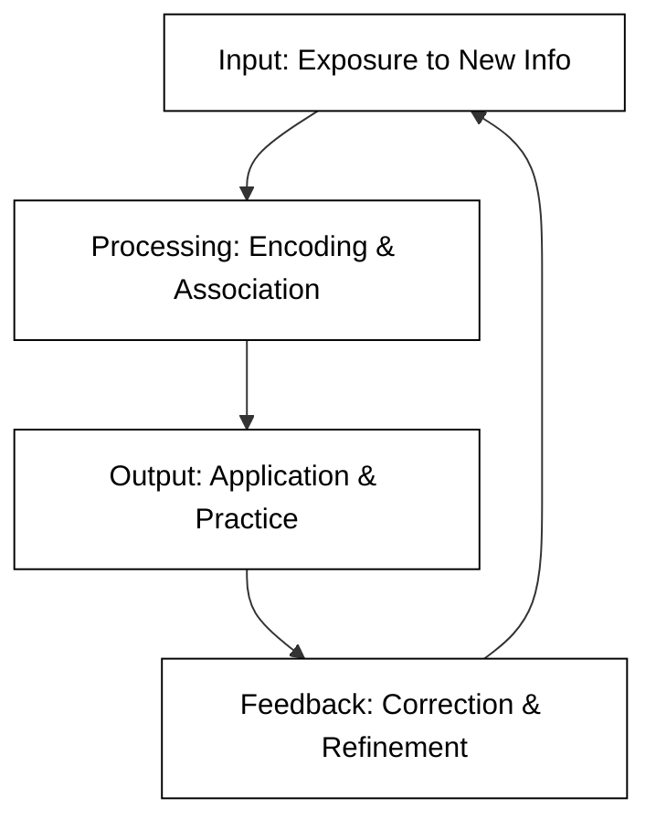

# Course name


## The Architecture of Learning

Learning is not a static event but a dynamic process of constructing knowledge. Just as a home requires a solid foundation, a frame, and finishing touches, the process of acquiring new skills involves building mental models that allow us to interpret the world. At its core, learning is about neuroplasticity—the brain's ability to reorganize itself by forming new neural connections in response to experience and practice.

To learn effectively, one must move beyond passive consumption (like reading a book or watching a video) and engage in active construction. This involves synthesizing new information with what you already know, a process known as *elaboration*. By connecting new concepts to existing "mental hooks," you ensure that the information is stored in long-term memory rather than being lost to the "forgetting curve."

### The Cycle of Knowledge Acquisition

Effective learning follows a cyclical pattern of input, application, and refinement. The following diagram illustrates how information moves from initial exposure to mastery:



### Core Pillars of Effective Learning

To optimize your study habits, consider these four evidence-based strategies:

1.  **Active Recall:** Testing yourself instead of just re-reading notes. This forces the brain to retrieve information, strengthening the neural pathway.
2.  **Spaced Repetition:** Reviewing material at increasing intervals over time to combat the forgetting curve.
3.  **Interleaving:** Mixing different topics or types of problems within a single study session to improve problem-solving flexibility.
4.  **Dual Coding:** Combining verbal materials with visual imagery to provide two different ways of representing the same information.

```masteryls
{"id":"intro_learning_01", "title":"Understanding Active Recall", "type":"multiple-choice"}
Which of the following activities best demonstrates the principle of "Active Recall"?

- [ ] Highlighting key passages in a textbook while reading for the first time.
- [ ] Listening to a recorded lecture while commuting to work or school.
- [x] Closing your book and writing down everything you remember about a topic from memory.
- [ ] Reading a chapter three times in a row to ensure the information "sinks in."
```

## Outcomes

By the end of the course you should have experienced the following outcomes.

- **Metacognitive Strategy Application**: Identify and apply evidence-based study techniques, including active recall and spaced repetition, to enhance long-term retention.
- **Cognitive Process Analysis**: Explain the biological foundations of learning, such as neuroplasticity and encoding, and their impact on knowledge acquisition.
- **Information Synthesis**: Utilize dual coding and elaboration to integrate new information into existing mental frameworks.
- **Reflective Practice**: Evaluate personal learning workflows and iterate on study habits to optimize academic and professional performance.