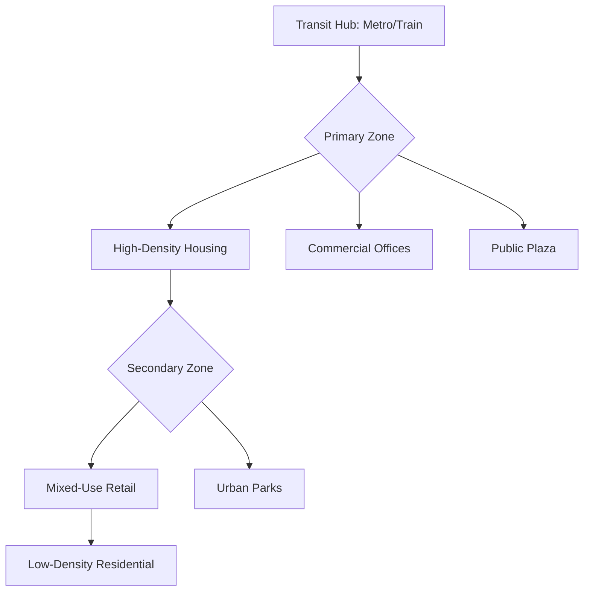

# City


## Principles of Sustainable Urban Design

Proper city design, often referred to as urban planning, is the technical and political process focused on the development and design of land use and the built environment. Modern urban design prioritizes **sustainability, accessibility, and human-centricity** over the mid-20th-century focus on automobile throughput. A well-designed city functions as an ecosystem where infrastructure, transit, and social spaces work in harmony to reduce carbon footprints and improve the quality of life for residents.

One of the most influential frameworks in contemporary design is the **15-Minute City**. This concept suggests that every resident should be able to access their daily needs—work, groceries, healthcare, and education—within a 15-minute walk or bike ride from their home. To achieve this, planners must move away from "Euclidean Zoning" (where residential and commercial areas are strictly separated) and toward mixed-use development.

### Core Elements of Effective Design

To build a resilient city, planners focus on several key pillars:

*   **Mixed-Use Zoning:** Integrating residential, commercial, and industrial spaces to reduce travel distances.
*   **Transit-Oriented Development (TOD):** Creating high-density housing and office spaces around major public transit hubs.
*   **Green Infrastructure:** Incorporating parks, bioswales, and "living walls" to manage stormwater and mitigate the urban heat island effect.
*   **The Grid and Connectivity:** Utilizing permeable street networks that offer multiple routes for pedestrians, preventing the "dead-ends" common in suburban cul-de-sacs.

The following diagram illustrates the flow of a Transit-Oriented Development model, showing how density radiates from a central transit hub:



### Data-Driven Planning

Modern cities use digital twins and data modeling to simulate traffic patterns and energy consumption. For instance, a developer might use a JSON-based configuration to define the parameters of a new "Smart District." This data allows the city to automate street lighting, optimize waste collection, and manage the power grid in real-time.

```json
{
  "district_name": "Riverside Tech Hub",
  "zoning_type": "Mixed-Use",
  "walkability_score": 92,
  "infrastructure": {
    "renewable_energy": ["Solar", "Geothermal"],
    "transit_access": ["Light Rail", "Bike Share", "Bus Rapid Transit"],
    "green_space_ratio": 0.25
  },
  "max_building_height_meters": 75
}
```

By prioritizing these elements, cities can transition from congested, car-dependent environments into vibrant, breathable spaces that support both economic growth and environmental health.

```masteryls
{"id":"urb-des-001", "title":"Understanding Mixed-Use Development", "type":"multiple-choice"}
What is the primary benefit of transitioning from traditional single-use zoning to mixed-use development within city design?

- [ ] It increases the total number of parking spaces required for commuters
- [ ] It ensures that residential areas are kept quiet by isolating them from commercial noise
- [x] It reduces car dependency by placing essential services within walking distance of residents
- [ ] It simplifies the architectural process by using uniform building designs across the city
```
