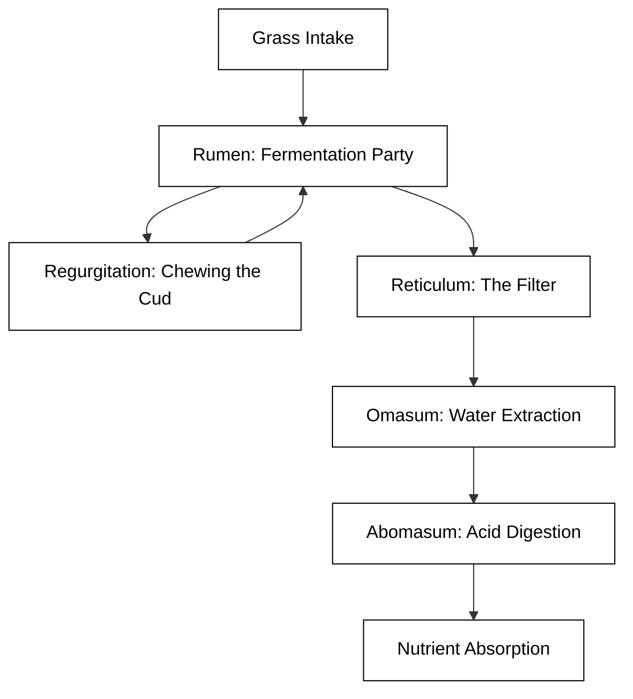

# cow


cows rock


## The Bovine Philosophy: More Than Just Grass-Fueled Lawn Ornaments

While the average person might see a cow as a slow-moving, grass-obsessed lawn ornament, the *Bos taurus* is actually a biological marvel of efficiency and social complexity. To understand a cow is to understand the art of "ruminating"—a word that describes both their digestive process and their apparent tendency to contemplate the deep mysteries of the universe while staring blankly at a fence post.

Cows are **ruminants**, which is a fancy way of saying they have a four-compartment stomach designed to turn structural carbohydrates (stuff humans can't eat, like grass) into high-quality protein. They don't just eat; they perform a multi-stage fermentation process that would make a craft brewer jealous.

### The Four-Stage Fermentation Factory

A cow's digestive tract is less of a tube and more of a complex industrial complex. Here is the breakdown of their internal "departments":

1.  **The Rumen:** The massive fermentation vat. It holds up to 50 gallons of partially digested material and billions of helpful microbes.
2.  **The Reticulum:** Known as the "honeycomb," it acts as a filter to catch heavy objects (like the occasional stray fence wire) that the cow definitely shouldn't have swallowed.
3.  **The Omasum:** Often called the "manyplies," this stage squeezes out the water. It’s the dehydrator of the bovine world.
4.  **The Abomasum:** The "true stomach," which functions most like a human stomach, using acid to finish the job.

The following diagram illustrates the "Grass-to-Energy Pipeline" that keeps a cow powered:



### Bovine Social Life and "Cow Logic"

Cows are surprisingly social creatures with complex hierarchies. They have "best friends" and can become stressed when separated from their preferred grazing buddies. Their communication isn't just a monotonous "moo"; it involves a variety of pitches and volumes that indicate hunger, frustration, or the bovine equivalent of "Hey, look at this cool rock!"

To better understand how a cow operates, we can look at a simplified "Cow Logic" algorithm written in Python:

```python
class Cow:
    def __init__(self, name, hunger_level=50):
        self.name = name
        self.hunger_level = hunger_level
        self.is_ruminating = False

    def evaluate_surroundings(self, object_seen):
        if object_seen == "Grass":
            return "Eat it."
        elif object_seen == "Fence":
            return "Stare at it for three hours."
        elif object_seen == "Human with bucket":
            return "Run toward them with uncoordinated joy."
        else:
            return "Moo suspiciously."

    def digest(self):
        if self.hunger_level > 0:
            self.is_ruminating = True
            print(f"{self.name} is now chewing the cud. Do not disturb.")

# Example usage:
bessie = Cow("Bessie")
print(bessie.evaluate_surroundings("Fence"))
bessie.digest()
```

### Fun Facts for the Aspiring Cow-Whisperer
*   **Panoramic Vision:** Cows have almost 360-degree panoramic vision, allowing them to see predators (or snacks) coming from almost any angle without moving their heads.
*   **Smell-O-Vision:** They can detect scents up to six miles away.
*   **The Saliva Factor:** A cow can produce up to 125 pounds of saliva a day to help lubricate all that dry grass.

```masteryls
{"id":"bovine-basics-01", "title":"The Ruminant System", "type":"multiple-choice"}
Why do cows "chew the cud" (regurgitate their food)?

- [ ] They are showing off their digestive prowess to other cows in the herd.
- [ ] They forgot what it tasted like and wanted a second opinion.
- [x] To further break down tough plant fibers that were softened in the rumen.
- [ ] It is a defense mechanism used to scare away potential predators.
```

```masteryls
{"id":"0e28ce18-f54a-4632-9f90-27deae07c846", "title":"Udder Capacity Ratio", "type":"multiple-choice"}
In dairy science, when evaluating a high-producing cow at peak fill, what is the approximate ratio of the weight of the milk contained in the udder to the weight of the empty udder tissue itself?

- [ ] 1:5 (The milk weight is much lower than the weight of the supportive tissue)
- [x] 1:1 (The milk weight is roughly equal to the weight of the empty udder)
- [ ] 10:1 (The milk weight is ten times the weight of the udder tissue)
- [ ] 1:4 (The milk accounts for only 20% of the total udder weight when full)
```
