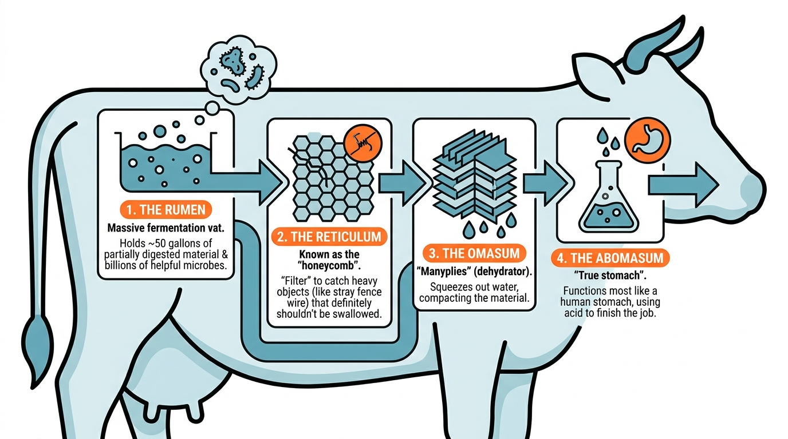

# cow


## The Bovine Philosophy: More Than Just Grass-Fueled Lawn Ornaments

While the average person might see a cow as a slow-moving, grass-obsessed lawn ornament, the *Bos taurus* is actually a biological marvel of efficiency and social complexity. To understand a cow is to understand the art of "ruminating"—a word that describes both their digestive process and their apparent tendency to contemplate the deep mysteries of the universe while staring blankly at a fence post.

Cows are **ruminants**, which is a fancy way of saying they have a four-compartment stomach designed to turn structural carbohydrates (stuff humans can't eat, like grass) into high-quality protein. They don't just eat; they perform a multi-stage fermentation process that would make a craft brewer jealous.

### The Four-Stage Fermentation Factory

A cow's digestive tract is less of a tube and more of a complex industrial complex. Here is the breakdown of their internal "departments":

1.  **The Rumen:** The massive fermentation vat. It holds up to 50 gallons of partially digested material and billions of helpful microbes.
2.  **The Reticulum:** Known as the "honeycomb," it acts as a filter to catch heavy objects (like the occasional stray fence wire) that the cow definitely shouldn't have swallowed.
3.  **The Omasum:** Often called the "manyplies," this stage squeezes out the water. It’s the dehydrator of the bovine world.
4.  **The Abomasum:** The "true stomach," which functions most like a human stomach, using acid to finish the job.

The following diagram illustrates the "Grass-to-Energy Pipeline" that keeps a cow powered:




### Bovine Social Life and "Cow Logic"

Cows are surprisingly social creatures with complex hierarchies. They have "best friends" and can become stressed when separated from their preferred grazing buddies. Their communication isn't just a monotonous "moo"; it involves a variety of pitches and volumes that indicate hunger, frustration, or the bovine equivalent of "Hey, look at this cool rock!"

To better understand how a cow operates, we can look at a simplified "Cow Logic" algorithm written in JavaScript:

```javascript
class Cow {
  constructor(name, hungerLevel = 50) {
    this.name = name;
    this.hungerLevel = hungerLevel;
    this.isRuminating = false;
  }

  evaluateSurroundings(objectSeen) {
    if (objectSeen === "Grass") {
      return "Eat it.";
    } else if (objectSeen === "Fence") {
      return "Stare at it for three hours.";
    } else if (objectSeen === "Human with bucket") {
      return "Run toward them with uncoordinated joy.";
    } else {
      return "Moo suspiciously.";
    }
  }

  digest() {
    if (this.hungerLevel > 0) {
      this.isRuminating = true;
      console.log(`${this.name} is now chewing the cud. Do not disturb.`);
    }
  }
}

// Example usage:
const bessie = new Cow("Bessie");
console.log(bessie.evaluateSurroundings("Fence"));
bessie.digest();
```

## Cow Vocalization: The Moo

Cows communicate through a vocalization known as **mooing** (scientifically referred to as **lowing**). This sound is a vital part of bovine social structure and behavior.

### Educational Key Concepts
*   **Communication:** Cows moo to express a variety of needs, including hunger, physical discomfort, or the desire to be milked.
*   **Maternal Recognition:** A cow and her calf use unique vocal signatures to identify and locate each other within a large herd.
*   **Social Cohesion:** Vocalizations help maintain contact between herd members, especially when moving across large grazing areas.

#### Listen to the cow mooing
<audio controls src="https://upload.wikimedia.org/wikipedia/commons/a/a5/Single_Cow_Moo.ogg">
  <a href="https://upload.wikimedia.org/wikipedia/commons/a/a5/Single_Cow_Moo.ogg">Listen to the cow mooing here.</a>
</audio>

#### Hear Charles 'Cow Cow' Davenport play the Atlanta Rag
<audio controls src="https://upload.wikimedia.org/wikipedia/commons/5/52/Charles_%27Cow_Cow%27_Davenport_-_Atlanta_Rag_%281922%29.ogg">
  <a href="https://upload.wikimedia.org/wikipedia/commons/5/52/Charles_%27Cow_Cow%27_Davenport_-_Atlanta_Rag_%281922%29.ogg">Hear Charles 'Cow Cow' Davenport play the Atlanta Rag</a>
</audio>

## The Art of Cow Watching: Observation and Behavior

To the uninitiated, watching a cow is a lesson in extreme patience and a study in existential stillness. They possess a unique ability to engage in a high-stakes staring contest that can last upwards of ten minutes without a single blink. As you stand by the fence, a cow will likely stop mid-chew, lock eyes with you, and project an aura of profound, silent judgment. It’s as if they are mentally auditing your taxes or questioning your choice of footwear, all while rhythmically rotating their lower jaw in a way that defies the standard laws of human physics. This meditative state is interrupted only by the occasional flick of an ear or a sudden, unexplained trot to the other side of the field.

Beyond the humor of their stoic expressions, observing cows provides deep insight into bovine biology and social structures. Cows are highly social animals that form complex hierarchies within their herds. When you see a group of cows all facing the same direction, they aren't just participating in a synchronized art piece; they are often aligning themselves with the wind or the sun to regulate body temperature and stay alert to potential threats.

<video controls width="600">
  <source src="https://upload.wikimedia.org/wikipedia/commons/0/0a/Cow_in_Cantabria.webm" type="video/webm" />
  Your browser does not support the video tag.
</video>

### Key Behaviors to Observe

When conducting "field research" on bovine behavior, look for these specific indicators:

*   **Rumination:** The process of regurgitating partially digested food (the "cud") to chew it again. This is a sign of a relaxed and healthy cow.
*   **Social Grooming:** Cows use their rough tongues to lick each other, which helps bond the herd and reduce stress.
*   **Ear Position:** Forward-facing ears often indicate curiosity, while ears pinned back can signal frustration or aggression.
*   **The "Flight Zone":** The distance at which a cow feels the need to move away from an approaching human.


## Fun Facts for the Aspiring Cow-Whisperer
*   **Panoramic Vision:** Cows have almost 360-degree panoramic vision, allowing them to see predators (or snacks) coming from almost any angle without moving their heads.
*   **Smell-O-Vision:** They can detect scents up to six miles away.
*   **The Saliva Factor:** A cow can produce up to 125 pounds of saliva a day to help lubricate all that dry grass.
*   **No Upper Front Teeth:** Instead of top front teeth, cows have a tough, leathery "dental pad" they use to press against their bottom teeth to tear grass.
*   **Magnetic Grazing:** Research suggests that cows have an internal compass and tend to face either North or South while grazing or resting.
*   **Social Sleepers:** While cows spend 10 to 12 hours a day lying down, they only actually sleep for about 4 hours—and they prefer to do it near their friends.
*   **Thirsty Work:** A high-producing dairy cow can drink up to 50 gallons of water in a single day—roughly the amount of water in a standard bathtub.

## Demonstrate your understanding

```masteryls
{"id":"41e1711a-63a9-4e69-9eac-a2cfa8afca5b", "title":"The Ruminant System", "type":"multiple-choice"}
Why do cows "chew the cud" (regurgitate their food)?

- [ ] They are showing off their digestive prowess to other cows in the herd.
- [ ] They forgot what it tasted like and wanted a second opinion.
- [x] To further break down tough plant fibers that were softened in the rumen.
- [ ] It is a defense mechanism used to scare away potential predators.
```

```masteryls
{"id":"0e28ce18-f54a-4632-9f90-27deae07c846", "title":"Udder Capacity Ratio", "type":"multiple-choice"}
In dairy science, when evaluating a high-producing cow at peak fill, what is the approximate ratio of the weight of the milk contained in the udder to the weight of the empty udder tissue itself?

- [ ] 1:5 (The milk weight is much lower than the weight of the supportive tissue)
- [x] 1:1 (The milk weight is roughly equal to the weight of the empty udder)
- [ ] 10:1 (The milk weight is ten times the weight of the udder tissue)
- [ ] 1:4 (The milk accounts for only 20% of the total udder weight when full)
```


```masteryls
{"id":"86422d90-fe84-457e-8cd6-0858dfb34b24", "title":"Cow Care", "type":"ai-web-page", "allowAiPrompt":false, "gradingCriteria":"The cow must say Yahoo after eating grass.", "height":500, "file":"cow.html" }
Help your cow grow strong. Make sure it says **Yahoo** when it eats grass.
```

