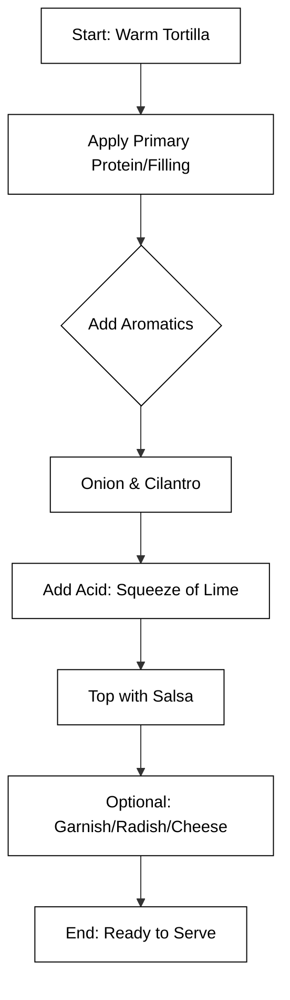

# final


## Mastering the Art and Science of the Taco

To achieve true mastery of the taco, one must understand that it is more than just a meal; it is a portable, versatile delivery system defined by the harmony of its components. At its core, a taco consists of three essential pillars: the **tortilla** (the foundation), the **filling** (the heart), and the **salsa/garnish** (the soul). Mastery involves balancing textures—crunchy vs. soft—and flavors—acidic vs. fatty.

The foundation of any authentic taco is the tortilla, typically made from corn that has undergone **nixtamalization**. This ancient process involves soaking corn in an alkaline solution (usually limewater), which improves nutritional value, flavor, and the structural integrity of the dough (masa). While flour tortillas are common in Northern Mexico and Tex-Mex cuisine, corn remains the traditional standard for most regional varieties.

### Key Regional Taco Varieties

Understanding the diversity of tacos is essential for a culinary expert. Here are the most prominent styles:

*   **Al Pastor:** Pork marinated in dried chilies and spices, cooked on a vertical spit (*trompo*), and often served with a slice of pineapple.
*   **Carne Asada:** Grilled steak, typically seasoned simply with salt and lime, providing a smoky flavor.
*   **Barbacoa:** Meat (traditionally sheep or goat) slow-cooked over an open fire or in a hole dug in the ground until tender.
*   **Tacos de Pescado:** Ensenada-style fish tacos, featuring battered and fried white fish, topped with cabbage and a creamy sauce.

### The Taco Assembly Workflow

The assembly of a taco must follow a logical order to ensure the tortilla does not become soggy and the flavors are distributed evenly.



### Representing a Taco in Data Structures

In a modern culinary database, a taco can be represented as a complex object. This allows chefs to track nutritional data, regional origins, and ingredient dependencies.

```json
{
  "taco": {
    "name": "Al Pastor",
    "foundation": "Corn Tortilla",
    "protein": {
      "type": "Pork",
      "preparation": "Spit-roasted",
      "marinade": ["Achiote", "Guajillo Chili", "Vinegar"]
    },
    "garnishes": ["Pineapple", "Cilantro", "White Onion"],
    "spiciness_level": 3,
    "is_gluten_free": true
  }
}
```

### The Role of Salsa

Salsa is the final layer of complexity. A master taco maker knows that the salsa should complement, not overpower, the protein. **Salsa Verde** (tomatillo-based) offers a bright, acidic counterpoint to fatty meats like *Suadero* or *Carnitas*, while **Salsa Roja** (dried chili-based) provides a deep, smoky heat that pairs well with grilled meats.

```masteryls
{"id":"taco-mastery-01", "title":"The Nixtamalization Process", "type":"multiple-choice"}
What is the primary purpose of nixtamalization in the context of traditional taco preparation?

- [ ] To bleach the corn so the tortillas appear whiter and more processed
- [ ] To flash-fry the tortilla dough to ensure it stays crispy after filling
- [x] To treat corn with an alkaline solution, enhancing its nutritional profile and dough-forming properties
- [ ] To ferment the salsa ingredients to ensure a probiotic-rich condiment
```


```masteryls
{"id":"1bbf8b11-d05d-4035-8685-5bc0efe724d2", "title":"The Anatomy of a Quality Taco", "type":"multiple-choice"}
When considering the final assembly of a high-quality, authentic taco, which factor is most critical for achieving a balanced flavor profile and structural integrity?

- [ ] Overloading the tortilla with as many toppings as possible to ensure a high calorie count and maximum weight.
- [x] The synergy between a fresh, warm tortilla, well-seasoned protein, and a bright contrast of acidity from lime or salsa.
- [ ] Using a cold, store-bought flour tortilla to ensure it does not tear when filled with heavy, unseasoned ingredients.
- [ ] Focusing entirely on the heat level of the peppers to ensure the spice level masks the flavor of the other components.
```


```masteryls
{"id":"ca847f9a-527d-4148-97fb-636a2a904981", "title":"The perfect fish taco", "type":"essay" }
Describe the ingredients and proper preperation of a Baja Style Fish Taco.
```

