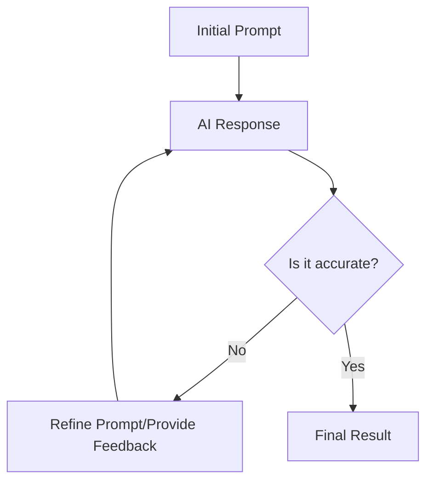

fds
fdsf
sd
fdsdsf
sd
f
ds
fdsdsf
fdsdsf


fdsdsffds fdsa fdsaf dsa f dsa f dsa f dsa fd sa fds af dsa f dsa fd saf ds af dsa f dsa f dsa fds af ds f dsa f dsa fd saf dsa f dsa f dsa fds af dsaf dsa fds af dsaf dsa fdsa f sda
fds
fdsdsf


fdsdsffdsfds


dsf
sdf
sd


# Junk heading


```js
function cow() {
  function rat() {
    function fish() {

      return "fish";
    }
    return fish();
  }
  return rat()
}

console.log(cow())
```

s
fdsf
sd
fdsdsf
sd
f
ds
fdsdsf
fdsdsf


fdsdsffds
fds
fdsdsf


fdsdsffdsfds


dsf
sdf
sd
s
fdsf
sd
fdsdsf
sd
f
ds
fdsdsf
fdsdsf


## Precision Prompting: Communicating Effectively with AI

Interacting with Large Language Models (LLMs) is less like searching on Google and more like delegating a task to a highly capable, yet literal-minded intern. To get the best results, you must move beyond simple keywords and focus on providing clear instructions, context, and constraints. This process, often called "Prompt Engineering," ensures the AI understands not just the "what," but the "how" and "why" of your request.

One of the most effective ways to structure a prompt is to use a framework that covers all necessary bases. A popular approach is the **R-A-C (Role, Action, Context)** method:
1.  **Role:** Tell the AI who it should be (e.g., "You are a senior software engineer").
2.  **Action:** Define the specific task (e.g., "Refactor this Python function").
3.  **Context:** Provide the necessary background or constraints (e.g., "Focus on readability and use the `logging` library instead of print statements").

### The Iterative Feedback Loop

Rarely is the first prompt perfect. Successful interaction requires an iterative process where you refine your instructions based on the AI's initial output. If the response is too wordy, ask it to be concise. If it misses a technical detail, point it out and ask for a revision.



### Best Practices for Success

To improve your success rate, consider the following strategies:
*   **Be Specific:** Instead of "Write about dogs," try "Write a 300-word blog post about the exercise needs of Golden Retrievers."
*   **Provide Examples (Few-Shot Prompting):** Show the AI the format you want. If you want a specific data structure, provide one or two completed examples first.
*   **Set Constraints:** Explicitly state what to avoid. For example, "Do not use jargon" or "Keep the code under 50 lines."
*   **Chain of Thought:** Ask the AI to "think step-by-step." This encourages the model to process logic more accurately before arriving at a final answer.

### Example: From Vague to Optimized

Observe the difference between a low-effort prompt and a high-quality prompt for the same goal.

**Vague Prompt (Poor Results):**
```text
Write a script to scrape a website.
```

**Optimized Prompt (High-Quality Results):**
```text
Role: You are a Python developer specializing in web scraping.
Action: Write a Python script using the BeautifulSoup library to extract the titles and prices of all books listed on 'http://books.toscrape.com'.
Context: 
- Store the results in a list of dictionaries.
- Include basic error handling for the network request.
- Add comments explaining each step of the process.
```

```masteryls
{"id":"ai-prompting-01", "title":"Identifying Effective Prompting", "type":"multiple-choice"}
Which of the following modifications is most likely to improve an AI's response to a complex task?

- [ ] Reducing the prompt to a single, broad keyword to avoid confusing the model.
- [ ] Asking the AI to generate the response as quickly as possible without checking its work.
- [x] Providing a specific role for the AI and asking it to "think step-by-step."
- [ ] Using vague language so the AI has more "creative freedom" with the technical facts.
```


fdsdsffds
fds
fdsdsf


fdsdsffdsfds


dsf
sdf
sd```js
function cow() {
  function rat() {
    function fish() {

      return "fish";
    }
    return fish();
  }
  return rat()
}

console.log(cow())
```

```js
function cow() {
  function rat() {
    function fish() {

      return "fish";
    }
    return fish();
  }
  return rat()
}

console.log(cow())
``````js
function cow() {
  function rat() {
    function fish() {

      return "fish";
    }
    return fish();
  }
  return rat()
}

console.log(cow())
```

```js
function cow() {
  function rat() {
    function fish() {

      return "fish";
    }
    return fish();
  }
  return rat()
}

console.log(cow())
```