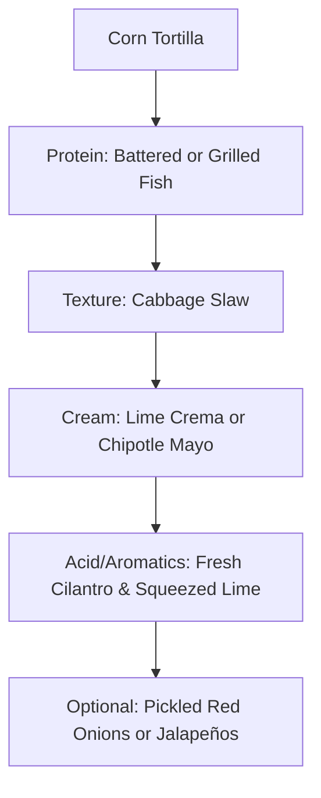

# Tacos


## The Anatomy of a Perfect Fish Taco

A truly exceptional fish taco is a study in contrast. It requires a delicate balance between the warmth of the protein, the crunch of the vegetables, and the acidity of the garnish. While many variations exist—ranging from the traditional Ensenada-style battered fish to modern grilled interpretations—the fundamental principles of flavor profile and structural integrity remain the same.

### 1. The Foundation: Fish Selection and Preparation
The "star of the show" must be handled with care. To achieve the best results, the fish should be fresh, mild, and firm enough to hold its shape within a tortilla.

*   **Best Fish Varieties:** Tilapia, Cod, Mahi-Mahi, or Halibut are preferred for their flaky texture and ability to absorb seasonings.
*   **Preparation Styles:**
    *   **Baja Style:** Dipped in a light, airy beer batter and deep-fried until golden. This provides a satisfying "crunch" that contrasts with the soft tortilla.
    *   **Grilled/Seared:** Seasoned with cumin, chili powder, and lime, then cooked over high heat. This is a lighter alternative that highlights the natural sweetness of the fish.

### 2. The Essential Layers
A good taco is built in layers to ensure every bite contains a representative sample of all ingredients. The following diagram illustrates the standard structural assembly:



### 3. Balancing Flavors and Textures
To ensure the taco doesn't become "one-note," chefs focus on the following four pillars:

1.  **Crunch:** Unlike beef tacos which often use hard shells, fish tacos almost exclusively use soft corn tortillas. Therefore, the crunch must come from a cabbage-based slaw rather than lettuce.
2.  **Acidity:** Fish has a high fat content (especially if fried). Adding lime juice or pickled elements "cuts" through the fat and brightens the palate.
3.  **Creaminess:** A white sauce (crema) acts as a binder, bridging the gap between the dry tortilla and the flaky fish.
4.  **Heat:** Whether through a spicy rub on the fish or a dash of habanero salsa, a hint of capsaicin elevates the dish.

### 4. Technical Integration: The Taco Configuration
In a culinary data system, a fish taco might be represented by a configuration object to ensure consistency across kitchen stations:

```json
{
  "taco_id": "FT-001",
  "name": "Classic Baja Fish",
  "protein": {
    "type": "White Fish",
    "preparation": "Beer-battered",
    "temp_celsius": 63
  },
  "vessel": "6-inch Yellow Corn Tortilla",
  "toppings": [
    "Shredded Green Cabbage",
    "Cilantro",
    "Pickled Onions"
  ],
  "sauce": "Lime-Garlic Crema"
}
```

```masteryls
{"id":"fish-taco-01", "title":"Identifying the Ideal Protein", "type":"multiple-choice"}
Why are white, flaky fish like Cod or Mahi-Mahi generally preferred for fish tacos over oily fish like Salmon or Mackerel?

- [ ] Oily fish are too expensive for street-style tacos.
- [ ] White fish have a stronger flavor that overpowers the salsa.
- [x] Their mild flavor and firm texture provide a neutral base that complements the acidity and spice of taco toppings.
- [ ] Flaky fish are the only types that can be safely fried in beer batter.
```
